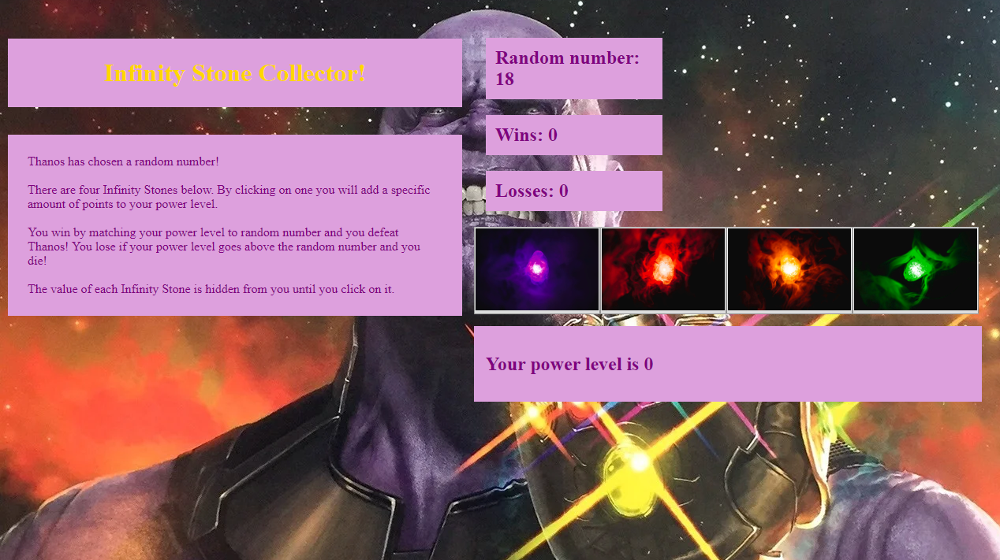

# Crystals Collector Game

## Objective

For this assignment we were to create an interactive game to play in the web browser that dynamically updates the browser using jQuery.

## Game Play Instructions

The objective is to take 4 image buttons that each generate 1 of 4 numbers.
Then add from the 4 number choices to match a randomly produced number.

You win if the you correctly add the number to match the random number.
Or you lose if your number goes over the random number.

---

## Technologies Used
* HTML
* Bootstrap
* jQuery
* Javascript

---

## File Structure

-Root
* Index.html
* assets
    * css
        * reset.css
        * style.css
    * javascript
        * game.js
    * images

---

## Deployed Link

[Crystal Collector](https://bwilson1990.github.io/unit-4-game/)

## Screenshots

